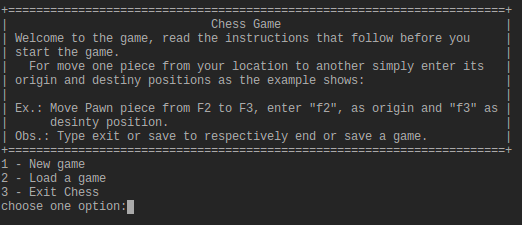
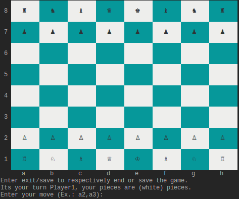

# CHESS GAME

This is the Ruby Course final project, below there is an explanation about how to play the game.

To start the game open a terminal (Linux/Mac) / command prompt (Windows) on the folder of the game and type "ruby chess.rb".

The image below will be shown.

Choose one option to among those showed on the screen.

if you choose the option **1 - New Game** you will be presented the screen below.

if you choose the option **2 - Load a game** the last game saved will be oppened just where it was saved.

After have created a new game or loaded a one saved, you can make the follow actions:

1. Move a piece (for that just follow the instructions on the screen)
2. Exit of the game (for that just type ***exit*** -****you will be asked if you want to save the game or not****)
3. To save a game by typing ***save***.

*Obs.: This game implement just only two situations of end game beside type* ***exit***, *that are:*

1. Checkmate
2. Stalemate

Have a fun!
