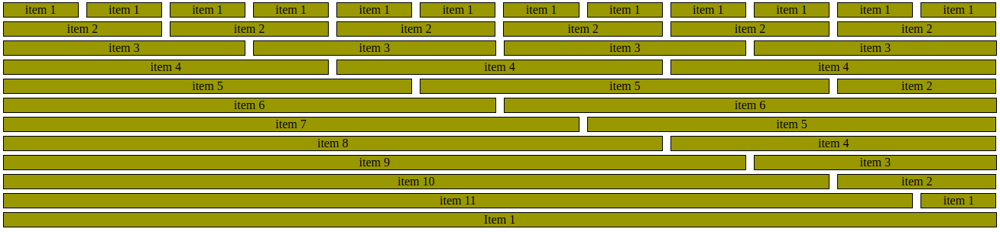
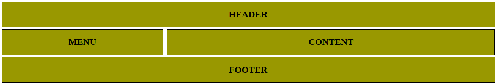
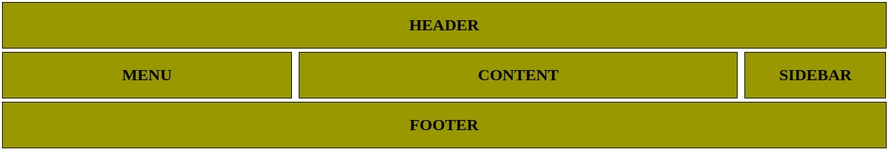

# SCAFFOLD GRID-BASED FRAMEWORK

Scaffold is a grid-based framework built from scratch to understand how Grid framework works and to put together all knowledge acquired during the course of [HTML & CSS](https://www.theodinproject.com/courses/html5-and-css3),
from [The Odin Project](https://www.theodinproject.com/courses/) Curriculum.

The Project is a solution to [PROJECT: DESIGN YOUR OWN GRID-BASED FRAMEWORK](https://www.theodinproject.com/courses/html5-and-css3/lessons/design-your-own-grid-based-framework) part of the above mentioned course.

## The Scaffold Framework

It is a simple framework (base on twelve columns) that contains only two may components ***Grid*** and ***Grid Item***, where the the first component works as a line and the last one works as cells. For more details about this they, look to the source code.

## Examples

Below some examples of the use of the framework.


## Twelve Columns Grid

```
<div class="grid">
  <div class="grid-item">item 1</div>
  <div class="grid-item">item 1</div>
  <div class="grid-item">item 1</div>
  <div class="grid-item">item 1</div>
  <div class="grid-item">item 1</div>
  <div class="grid-item">item 1</div>
  <div class="grid-item">item 1</div>
  <div class="grid-item">item 1</div>
  <div class="grid-item">item 1</div>
  <div class="grid-item">item 1</div>
  <div class="grid-item">item 1</div>
  <div class="grid-item">item 1</div>
</div>

<div class="grid">
  <div class="grid-item-2">item 2</div>
  <div class="grid-item-2">item 2</div>
  <div class="grid-item-2">item 2</div>
  <div class="grid-item-2">item 2</div>
  <div class="grid-item-2">item 2</div>
  <div class="grid-item-2">item 2</div>
</div>

<div class="grid">
  <div class="grid-item-3">item 3</div>
  <div class="grid-item-3">item 3</div>
  <div class="grid-item-3">item 3</div>
  <div class="grid-item-3">item 3</div>
</div>

<div class="grid">
  <div class="grid-item-4">item 4</div>
  <div class="grid-item-4">item 4</div>
  <div class="grid-item-4">item 4</div>
</div>

<div class="grid">
  <div class="grid-item-5">item 5</div>
  <div class="grid-item-5">item 5</div>
  <div class="grid-item-2">item 2</div>
</div>

<div class="grid">
  <div class="grid-item-6">item 6</div>
  <div class="grid-item-6">item 6</div>
</div>

<div class="grid">
  <div class="grid-item-7">item 7</div>
  <div class="grid-item-5">item 5</div>
</div>

<div class="grid">
  <div class="grid-item-8">item 8</div>
  <div class="grid-item-4">item 4</div>
</div>

<div class="grid">
  <div class="grid-item-9">item 9</div>
  <div class="grid-item-3">item 3</div>
</div>

<div class="grid">
  <div class="grid-item-10">item 10</div>
  <div class="grid-item-2">item 2</div>
</div>

<div class="grid">
  <div class="grid-item-11">item 11</div>
  <div class="grid-item">item 1</div>
</div>

<div class="grid">
  <div class="grid-item-12">Item 1</div>
</div>
```
that goes to generation the below image:



## Two Columns Layout

```
<div class="two-columns-layout">

  <div class="grid">
    <div class="grid-item-12">
      <h2>HEADER</h2>
    </div>
  </div>
</div>

<div class="grid">
  <div class="grid-item-4">
    <h2>MENU</h2>
  </div>
  <div class="grid-item-8">
    <h2>CONTENT</h2>
  </div>
</div>

<div class="grid">
  <div class="grid-item-12">
    <h2>FOOTER</h2>
  </div>
</div>
```

that generates the follow image:




## Three Columns Layout

```
<div class="three-columns-layout">

  <div class="grid">
    <div class="grid-item-12">
      <h2>HEADER</h2>
    </div>
  </div>

  <div class="grid">
    <div class="grid-item-4">
      <h2>MENU</h2>
    </div>
    <div class="grid-item-6">
      <h2>CONTENT</h2>
    </div>
    <div class="grid-item-2">
      <h2>SIDEBAR</h2>
    </div>
  </div>

  <div class="grid">
    <div class="grid-item-12">
      <h2>FOOTER</h2>
    </div>
  </div>

</div>
```

